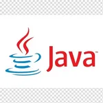

## План автоматизации тестирования возможности записи на обучение профессии "Тестировщик ПО".

](https://github.com/netology-code/aqa-homeworks/blob/master/summary/pictures/form.jpg?raw=true)

## Уровни тестирования:

* Модульное тестирование - проверяем отдельно модули "Каталог курсов" и "Заполнение анкеты";
* Интеграционное тестирование - проверяем взаимодействие между компонентами (Переход с главной страницы на страницу "
  Каталог курсов", переход из "Каталог курсов" в заполнение анкеты);

## Виды тестирования:

* Функциональное тестирование;
* Дымовое тестирование;

## Перечень автоматизируемых сценариев:

1. Проверка открытия страницы "Нетология";
1. Проверка наличия анкеты в конце страницы на заполнение заявки
1. Проверка Заполнения заявки;
1. Проверка наличия кнопки "Оставить заявку"
1. Проверка отправки заявки;
1. Проверка наличия вкладки "Каталог курсов" -> "Программирование" -> "Тестировщик ПО";
1. Проверка перехода на страницу "Каталог курсов";
1. Проверка перехода на страницу "Программирование";
1. Проверка перехода на страницу "Тестировщик ПО";
1. Проверка кнопки "Записаться" на странице(осуществляется переход к пункту заполнения полей в анкете);
1. Проверка перехода на страницу "Запишитесь или получите консультацию";
1. Проверка перехода на страницу "Запишитесь или получите консультацию" , при успешном переходе есть анкета для заполнения, 
   заполняем ее;
1. Проверка кнопок "Записаться";
1. Проверка отправки заявки;
1. Проверка наличия вкладки "НЕО для начинающих" -> "Получите профессию с нуля" -> "Тестировщик ПО"
1. Проверка перехода на страницу "Получите профессию с нуля"
1. Проверка кнопки "Записаться" на странице(осуществляется переход к пункту заполнения полей в анкете);
1. Проверка перехода на страницу "Запишитесь или получите консультацию";
1. Проверка перехода на страницу "Запишитесь или получите консультацию" , при успешном переходе есть анкета для заполнения, 
   заполнение анкеты;
1. Проверка кнопки "Записаться";

#### Форма анкеты:

* Позитивные сценарии:

1. Проверяем форму валидными значениями (Имя создать с помощью фейкера на русском, 
создать номер мобильного телефона с помощью фейкера, сгенерировать с  помощью фейкера email на английском языке, нажать
   кнопку "Записаться");
2. Проверяем форму валидными значениями (Имя сделать двойное, с дефисом, создать номер мобильного телефона с помощью фейкера, сгенерировать с  помощью фейкера email на английском языке, нажать
   кнопку "Записаться");
3. Проверяем кнопку "Получить консультацию" на работоспособность (после нажатия запрос уходит).
4. Проверяем действительность ссылки "Нажимая кнопку, принимаю условия политики и пользовательского соглашения";

**_Ожидаемые результаты:_**

1. Появится надпись "Заявка принята" и произойдет перехода на страницу оплаты.
1. Появится надпись ""Заявка принята" и произойдет перехода на страницу оплаты.
1. В сплывающем окне открывается документ о соглашении;
1. Произойдет переход на страницу консультации , придет подтверждающее письмо на почту "Заявка на консультацию по
   курсу <<Тестировщик ПО>> оформлена" .

* Негативные сценарии:

1. Проверяем заполнение всех полей, кроме имени;
2. Проверяем заполнение всех полей, кроме номера;
3. Проверяем заполнение всех полей, кроме email;
4. Проверяем на некорректность заполнения формы, ставим на поле имя значение из фейкера, но на английском языке;
5. Проверяем на некорректность заполнения формы, ставим на поле имя значение в один символ русской буквы;
6. Проверяем на некорректность заполнения формы, ставим на поле имя значение в цифрах;
7. Проверяем на некорректность заполнения формы, ставим на поле номер, значение, на единицу меньше правильного числа цифр в номере;
8. Проверяем на некорректность заполнения формы, ставим на поле номер значение, на единицу больше правильного числа цифр в номере;
9. Проверяем на некорректность заполнения формы, ставим на поле номер любое символьное значение, например, "+";
10. Проверяем на некорректность заполнения формы, ставим на поле email значение из фейкера, но на Русском языке;
11. Проверяем на некорректность заполнения формы, ставим на поле email значение из фейкера, но без "@";
12. Проверяем поле Имя граничными значениями.
13. Проверяем поле Email граничными значениями.

**_Ожидаемые результаты:_**

1. Появится надпись, что поле обязательно для заполнения;
2. Появится надпись, что поле обязательно для заполнения;
3. Появится надпись, что поле обязательно для заполнения;
4. Появится надпись, что неправильно введено значение;
5. Появится надпись, что неправильно введено значение;
6. Появится надпись, что неправильно введено значение;
7. Появится надпись, что неправильно введено значение или номер должен состоять из 10 цифр;
8. Появится надпись, что неправильно введено значение или номер должен состоять из 10 цифр;
9. Появится надпись, неверный формат;
10. Появится надпись, неверный формат;
11. Появится надпись, неверный формат;
12. Появится надпись, что неправильно введено значение;
13. Появится надпись, что неправильно введено значение;

## Перечень используемых инструментов:

java | язык, на котором будем писать тесты (код)
 -------|----------------------------------------------------------------------------
IntelliJ IDEA  | программа, в которой пишем тесты (код)
Gradle   | система автоматической сборки внутри IntelliJ IDEA
JUnit 5   | библиотека для тестирования
Faker | генерация пользовательских данных (имени, телефона, email)
Selenide | для работы с веб-страницей
Allure | используем для наглядного изображения прохождения тестов и ошибок

](https://im0-tub-ru.yandex.net/i?id=ac6d83994beddfa921575d0c1a605eca&ref=rim&n=33&w=150&h=150)
](https://im0-tub-ru.yandex.net/i?id=60cc9cb4460463d1f83595d3ede3c43d&ref=rim&n=33&w=150&h=150)
](https://im0-tub-ru.yandex.net/i?id=4e2de00e9c8643235ab4aa45203b7299&ref=rim&n=33&w=217&h=150)
](https://im0-tub-ru.yandex.net/i?id=60e22a1e490a59813afcdfce78c40da8&ref=rim&n=33&w=267&h=150)
](https://im0-tub-ru.yandex.net/i?id=bd05275f229047a082c15a89391d1828&ref=rim&n=33&w=150&h=150)
](https://www.ph4.ru/DL/LOGO/a/allure.gif)
## Перечень необходимых разрешений:

* Разрешение на тестирование страниц сайта с помощью автоматизированного ПО;
* Разрешение на доступ к базе данных;
* Предоставление тестовых аккаунтов.

## Перечень и описание возможных рисков при автоматизации:

* Возможна смена кода страницы либо css-селекторов, придется править код;
* Смена формы заполнения после какого-либо времени;
* Невозможность написания в форме некоторых букв (например, буквы ё);
* Долгое открытие страницы сайта, либо вкладки;
* Недоступность сайта или страницы;
* Неоправданная стоимость автоматизации;
* Искажение результатов тестов в связи с отсутствием доступа к реальной БД;

## Перечень необходимых специалистов для автоматизации:

* Специалист по автоматизированному тестированию;

## Интервальная оценка с учётом рисков (в часах):

* Необходимое время на тестирование составляет 50 часов, с учетом рисков - 65 часов. 